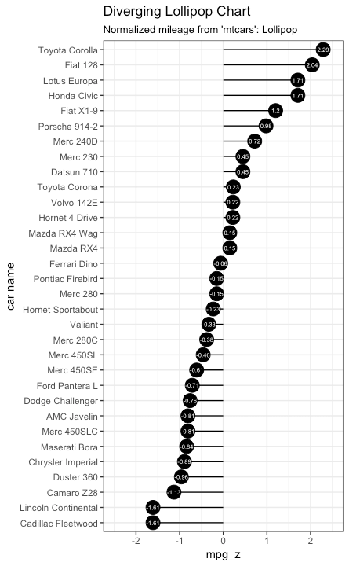

Clear environment and load libraries


```{r}
rm(list = ls())

library('dplyr')
library('ggplot2')
```


Load and manipulate data

```{r}
surveys <- read.csv("data/combined.csv")
surveys_complete <- surveys %>%
  filter(species_id != "",         # remove missing species_id
         !is.na(weight),           # remove missing weight
         !is.na(hindfoot_length),  # remove missing hindfoot_length
         sex != "")                # remove missing sex

# Extract the most common species_id
species_counts <- surveys_complete %>%
  group_by(species_id) %>%
  tally %>%
  filter(n >= 50)

# Only keep the most common species
surveys_complete <- surveys_complete %>%
  filter(species_id %in% species_counts$species_id)
```

## Diverging Bars

```{r}
mean_weight <- mean(surveys_complete$weight)
sd_weight <- sd(surveys_complete$weight)

species_weight <- surveys_complete %>%
  group_by(species) %>%
  summarize(avg_weight = mean(weight)) %>%
  mutate(weight_z = round(((avg_weight - mean_weight)/sd_weight),2)) %>%
  mutate(weight_type = ifelse(weight_z < 0, "below", "above")) %>%
  arrange(weight_z) %>%
  mutate(species_order = as.character(species)) %>% # create new factor column that conform to the new order
  mutate(species_order = factor(species, levels = species))
```

Standard bar geometric:

```{r}
ggplot(species_weight, aes(x=species_order, label=weight_z)) +
  geom_bar(aes(weight = weight_z, fill = weight_type), width = 0.5) + 
  scale_fill_manual(name = 'Weight',
                    labels = c('Above Average','Below Average'),
                    values = c('above'='red','below'='green')) +
  labs(subtitle="Normalized Weight of Species", 
       y="Weight", 
       x="Species", 
       title="Diverging Bars with geom_bar", 
       caption = "Source: Species Survey") +
  theme_bw() +
  coord_flip()
```


```{r}
ggplot(species_weight, aes(x=species_order, y=weight_z, label=weight_z)) +
  geom_col(stat = 'identity', aes(fill = weight_type), width = 0.5) + 
  scale_fill_manual(name = 'Weight',
                    labels = c('Above Average','Below Average'),
                    values = c('above'='red','below'='green')) +
  labs(subtitle="Normalized Weight of Species", 
       y="Weight", 
       x="Species", 
       title="Diverging Bars with geom_col", 
       caption = "Source: Species Survey") + 
  theme_bw() +
  coord_flip()
```

**Challenge**

Another version of divering bars is called *Lollipop* and it has the following form:



The creation of this plot use the same data set but involve the following geometrics:
- `geom_point` to create the black circle
- `geom_segment` to create the lines
- `geom_text` to display the numerical values

Create a diverging lollipop chart for the species_weight data

```{r}
ggplot(species_weight, aes(x=species_order, y=weight_z, label=weight_z)) +
  geom_point(stat = 'identity', fill = '____', size = __) + 
  geom_segment(aes(y = 0,
                   x = species_order,
                   yend = ______,
                   xend = ___________)) + 
  geom_text(color = 'white', size = __) +
  labs(subtitle="Normalized Weight of Species", 
       y="Weight", 
       x="Species", 
       title="Diverging Lollipop Chart", 
       caption = "Source: Species Survey") + 
  theme_bw() +
  coord_flip()

```

## Area Chart

```{r}
dipodomys <- surveys_complete %>%
  filter(genus == 'Dipodomys') %>%
  group_by(year) %>%
  summarize(avg_weight = mean(weight)) 

mean_dipodomys <- mean(dipodomys$avg_weight)

dipodomys <- dipodomys %>%
  mutate(diff_weight = avg_weight - mean_dipodomys)

ggplot(dipodomys, aes(year, diff_weight)) +
  geom_area() + 
  theme(axis.text.x = element_text(angle=90)) + 
  labs(subtitle="Weight Change", 
       y="Weight", 
       x="Year", 
       title="Area Chart", 
       caption = "Source: Species Survey") + 
  theme_bw()
```


