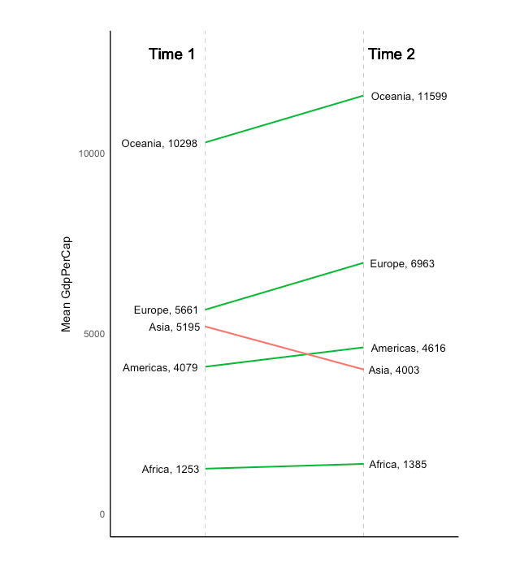

Clear environment and load libraries

```{r}
rm(list = ls())

library('dplyr')
library('scales')
library('ggplot2')
```

Load and manipulate data

```{r}
library(babynames)

diff_babynames <- babynames %>%
  filter (year %in% c(2010, 2015)) %>%
  select(year, name, n)

library(reshape2)
wide_babynames <- dcast(diff_babynames, name ~ year, fun.aggregate = sum, value.var = 'n')
wide_babynames <- wide_babynames %>%
  filter(`2010` != 0 & `2015` != 0) %>%
  arrange(desc(`2015`)) %>%
  head(n = 10)
```

## Slope chart



```{r}
left_label <- paste(wide_babynames$name, wide_babynames$`2010`, sep=", ")
right_label <- paste(wide_babynames$name, wide_babynames$`2015`, sep=", ")
wide_babynames$class <- ifelse((wide_babynames$`2015` - wide_babynames$`2010`) < 0, "red", "green")
```


Initial plot that draw lines connecting data points for each name. 

```{r}
ggplot(wide_babynames) + 
  geom_segment(aes(x=1, xend=2, y=`2010`, yend=`2015`, col=class), size=.75, show.legend=F)
```

Next, we add the vertical lines

```{r}
ggplot(wide_babynames) + 
  geom_segment(aes(x=1, xend=2, y=`2010`, yend=`2015`, col=class), size=.75, show.legend=F) + 
  geom_vline(xintercept=1, linetype="dashed", size=.1) + 
  geom_vline(xintercept=2, linetype="dashed", size=.1)
```

Next, we change the color scheme of increasing and decreasing lines. 

```{r}
ggplot(wide_babynames) + 
  geom_segment(aes(x=1, xend=2, y=`2010`, yend=`2015`, col=class), size=.75, show.legend=F) + 
  geom_vline(xintercept=1, linetype="dashed", size=.1) + 
  geom_vline(xintercept=2, linetype="dashed", size=.1) +
  scale_color_manual(labels = c("Up", "Down"), 
                     values = c("green"="#00ba38", "red"="#f8766d"))
```

we can also modify the layouts of the canvas for labels and axis limits to improve visibility. 

```{r}
ggplot(wide_babynames) + 
  geom_segment(aes(x=1, xend=2, y=`2010`, yend=`2015`, col=class), size=.75, show.legend=F) + 
  geom_vline(xintercept=1, linetype="dashed", size=.1) + 
  geom_vline(xintercept=2, linetype="dashed", size=.1) +
  scale_color_manual(labels = c("Up", "Down"), 
                     values = c("green"="#00ba38", "red"="#f8766d")) +  # color of lines
  labs(x="", y="Baby names count") +  # Axis labels
  xlim(.5, 2.5) + ylim(0,(1.1*(max(wide_babynames$`2010`, wide_babynames$`2015`))))  # X and Y axis limits
```


We can add text annotations to the plot's vertical columns

```{r}
ggplot(wide_babynames) + 
  geom_segment(aes(x=1, xend=2, y=`2010`, yend=`2015`, col=class), size=.75, show.legend=F) + 
  geom_vline(xintercept=1, linetype="dashed", size=.1) + 
  geom_vline(xintercept=2, linetype="dashed", size=.1) +
  scale_color_manual(labels = c("Up", "Down"), 
                     values = c("green"="#00ba38", "red"="#f8766d")) +  # color of lines
  labs(x="", y="Baby names count") +  # Axis labels
  xlim(.5, 2.5) + ylim(0,(1.1*(max(wide_babynames$`2010`, wide_babynames$`2015`)))) + # X and Y axis limits
  geom_text(label=left_label, y=wide_babynames$`2010`, x=rep(1, NROW(wide_babynames)), hjust=1.1, size=3.5) + 
  geom_text(label=right_label, y=wide_babynames$`2015`, x=rep(2, NROW(wide_babynames)), hjust=-0.1, size=3.5) + 
  geom_text(label="Time 1", x=1, y=1.1*(max(wide_babynames$`2010`, wide_babynames$`2015`)), hjust=1.2, size=5) +  # title
  geom_text(label="Time 2", x=2, y=1.1*(max(wide_babynames$`2010`, wide_babynames$`2015`)), hjust=-0.1, size=5)  # title
```

We can attempt to clear up the plot by changing the theme's background

```{r}
theme_set(theme_classic())
ggplot(wide_babynames) + 
  geom_segment(aes(x=1, xend=2, y=`2010`, yend=`2015`, col=class), size=.75, show.legend=F) + 
  geom_vline(xintercept=1, linetype="dashed", size=.1) + 
  geom_vline(xintercept=2, linetype="dashed", size=.1) +
  scale_color_manual(labels = c("Up", "Down"), 
                     values = c("green"="#00ba38", "red"="#f8766d")) +  # color of lines
  labs(x="", y="Baby names count") +  # Axis labels
  xlim(.5, 2.5) + ylim(0,(1.1*(max(wide_babynames$`2010`, wide_babynames$`2015`)))) + # X and Y axis limits
  geom_text(label=left_label, y=wide_babynames$`2010`, x=rep(1, NROW(wide_babynames)), hjust=1.1, size=3.5) + 
  geom_text(label=right_label, y=wide_babynames$`2015`, x=rep(2, NROW(wide_babynames)), hjust=-0.1, size=3.5) + 
  geom_text(label="Time 1", x=1, y=1.1*(max(wide_babynames$`2010`, wide_babynames$`2015`)), hjust=1.2, size=5) +  # title
  geom_text(label="Time 2", x=2, y=1.1*(max(wide_babynames$`2010`, wide_babynames$`2015`)), hjust=-0.1, size=5) + # title
  theme(panel.background = element_blank(), # Minify theme
        panel.grid = element_blank(),
        axis.ticks = element_blank(),
        axis.text.x = element_blank(),
        panel.border = element_blank(),
        plot.margin = unit(c(1,2,1,2), "cm"))

```


** Challenge: **

What can be done to make the above labels more visiable to readers?

```{r}


```

## Dumbbell Chart

Another approach to represent ranking is to use the dumbbell chart

```{r}
library(ggalt)
theme_set(theme_classic())

wide_babynames <- wide_babynames %>%
  arrange(`2010`)
wide_babynames$name  <- factor(wide_babynames$name, 
                               levels=as.character(wide_babynames$name))  # for right ordering of the dumbells

# health$Area <- factor(health$Area)
ggplot(wide_babynames, aes(x=`2010`, xend=`2015`, y=name, group=name)) + 
  geom_dumbbell(colour_xend="#a3c4dc", 
                size_xend=2, 
                colour_x="#0e668b",
                size_x= 2,
                colour = "red") + 
  scale_x_continuous() + 
  labs(x=NULL, 
       y=NULL, 
       title="Dumbbell Chart", 
       subtitle="Baby Names Change: 2010 vs 2015") +
  theme(plot.title = element_text(hjust=0.5, face="bold"),
        plot.background=element_rect(fill="#f7f7f7"),
        panel.background=element_rect(fill="#f7f7f7"),
        panel.grid.minor=element_blank(),
        panel.grid.major.y=element_blank(),
        panel.grid.major.x=element_line(),
        axis.ticks=element_blank(),
        legend.position="top",
        panel.border=element_blank())
```


